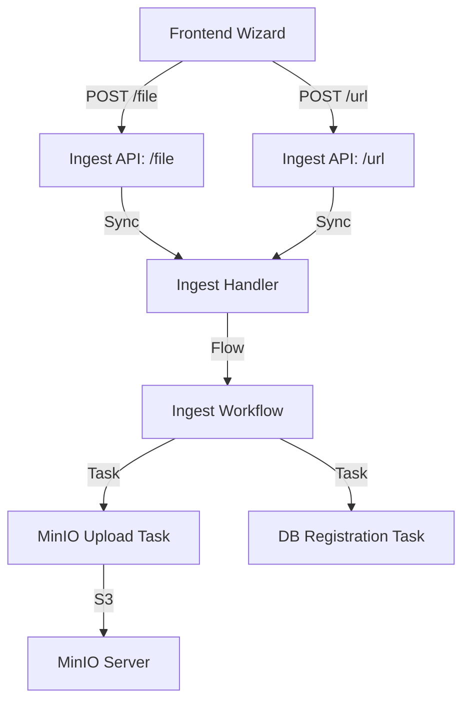

# Architecture: Granular Knowledge Ingestion

## Overview
Transitions from a server-side bulk ingestion model to a client-side orchestrated model.

## Component Diagram


## API Specifications

### `POST /api/knowledge-base/services/{service_id}/ingest/file`
- **Content-Type**: `multipart/form-data`
- **Fields**:
  - `files`: File[]
  - `metadata`: JSON string (optional)

### `POST /api/knowledge-base/services/{service_id}/ingest/url`
- **Content-Type**: `application/json`
- **Body**:
  ```json
  {
    "urls": ["string"]
  }
  ```
