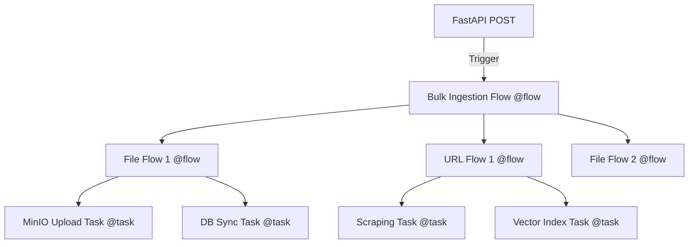

# Architecture: Prefect-Orchestrated Multi-Type Ingestion

## Overview
The Knowledge Base Ingestion capability is refactored to use **Prefect** for orchestration. This provides formal lifecycle management, retries, and detailed traceability for every ingestion phase.

## Orchestration Layers

### 1. Ingest Entry Point (`handler.py`)
- FastAPI handler that triggers the main Prefect flow.
- Invokes `IngestWorkflowOrchestrator.process_bulk` using `.run()` or async call.

### 2. Main Flow (`IngestWorkflowOrchestrator.process_bulk`)
- Decorated with `@flow(name="Bulk Ingestion Flow")`.
- Orchestrates the batch processing logic.
- Dynamically resolves sub-workflows for each source.

### 3. Source Workflows (`workflows/*.py`)
- Each implementation (e.g., `FileIngestWorkflow.execute`) is decorated with `@flow`.
- This creates a **sub-flow** record in Prefect for every individual data source (e.g., specific file, specific URL).

### 4. Atomic Tasks (`tasks.py`)
- Low-level operations (e.g., `upload_files_to_minio`) are decorated with `@task`.
- Provides granular tracking of system interactions.

## Traceability Diagram

