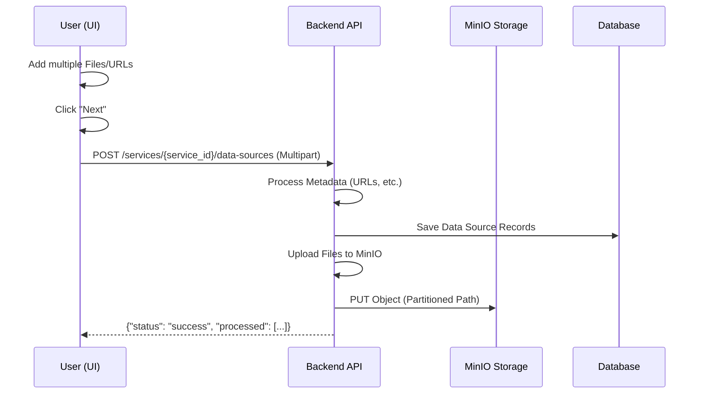

# Architecture: Knowledge Base Ingestion

## Overview
The Knowledge Base Ingestion capability allows users to upload various data source types (Files, URLs, S3) to power the AI Service. All file-based knowledge is stored in MinIO, while structural data is recorded in the ServiceGen database.

## Components

### 1. Frontend (Next.js)
- **Component**: `NewServicePage` (Step 3)
- **Responsibility**: 
    - Support batch addition of files.
    - Track a collection of data sources (type + value/files).
    - Perform a unified ingest request on "Next".

### 2. Backend API (FastAPI)
- **Route**: `POST /services/{service_id}/data-sources`
- **Responsibility**: 
    - Parse multipart/form-data.
    - `files`: Collection of `UploadFile` objects.
    - `metadata`: JSON payload describing the source types and their association (e.g., which files belong to which logical "source" entry).

### 3. MinIO Client (Task Layer)
- **Responsibility**: Partitioned storage under `/{tenant_id}/{org_id}/{service_id}/{filename}`.

## Data Flow

## Storage Structure
Bucket: `servicegen-knowledge`
Path: `/{tenant_id}/{org_id}/{service_id}/{filename}`
