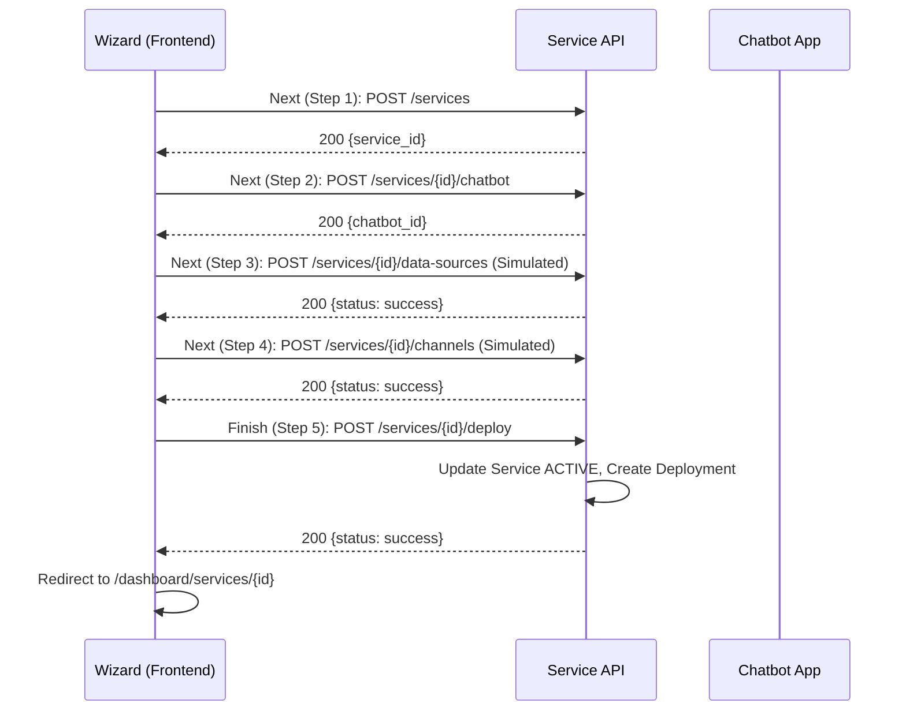

# Architecture - Wizard Persistence & Deployment

## Sequence Diagram

## Integration Details
- **Chatbot App**: Linked via `service_id` and `chatbot_id`. The playground will eventually point to `bot.servicegen.local?service_id={id}`.
- **Simulated Steps**: Steps 3 and 4 will hit generic "patch" or "update" endpoints that return success for now.
