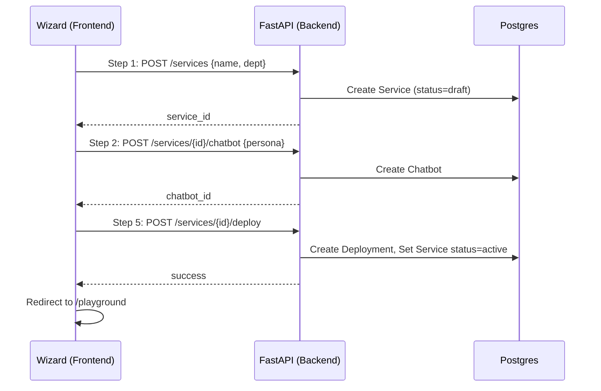

# Architecture - Service Creation Flow

## Components

### 1. Frontend Wizard (`page.tsx`)
- **State**: `serviceId`, `chatbotId`.
- **Flow**:
    - **Step 1 (Details)**: Clicking "Next" calls `POST /api/service/services`. Backend returns `service_id`.
    - **Step 2 (Chatbot)**: Clicking "Next" calls `POST /api/service/services/{service_id}/chatbot`. Backend returns `chatbot_id`.
    - **Step 5 (Finish)**: Clicking "Finish" calls `POST /api/service/services/{service_id}/deploy`. Redirection to playground.

### 2. Backend Capability (`create_service`)
- **Tasks**: Atomic database operations using SQLAlchemy.
- **Workflow**: Orchestrates multi-step creation.
- **API**: FastAPI endpoints under `/api/service`.

### 3. Database Layer
- **Models**: `Service`, `Chatbot`, `Deployment` (schema: `service`).
- **Referenced Models**: `Tenant`, `Organization` (schema: `core`).
- **Fix**: Critical requirement to import `core` models in the API entry point to allow foreign key resolution.

## Sequence Diagram

