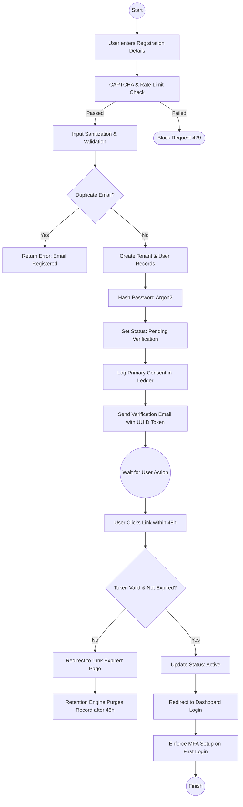

# Tenant Registration Workflow
Version: 1.0
Domain: Tenant Management
Alignment: Requirements Spec v1.0, Security Spec v1.0, Privacy Spec v1.0

---

## 1. Workflow Diagram (Logic)

---

## 2. Step-by-Step Breakdown

### Step 1: Frontend Submission
- **Action**: User provides `Organization Name`, `Admin Email`, `Password`.
- **Constraint**: Must explicitly check "I agree to Terms & Privacy Policy" (PRV-TEN-REG-001).
- **Security**: Form protected by CAPTCHA (SEC-TEN-REG-002).

### Step 2: Ingestion & Validation
- **Action**: Backend receives POST request.
- **Security**: Check IP rate limit (SEC-TEN-REG-002).
- **Validation**:
    - Sanitize inputs to prevent SQLi (SEC-TEN-REG-003).
    - Validate password complexity (NFR-TEN-REG-002).
    - Check if email exists in `users` table.

### Step 3: Atomic Persistence
- **Action**: Start database transaction.
    - Generate unique `tenant_id` (UUID).
    - Create `tenants` record (REQ-TEN-REG-001).
    - Generate unique `user_id` (UUID).
    - Hash password using Argon2.
    - Create `users` record with `role='Admin'` linked to `tenant_id` (REQ-TEN-REG-002).
- **Privacy**: Log consent in `consent_ledger`.

### Step 4: Verification Trigger
- **Action**: Generate high-entropy token (RISK-TEN-REG-2026-002).
- **Action**: Send email via SMTP/SES.
- **State**: Tenant status set to `Pending Verification`.

### Step 5: Activation Lifecycle
- **Trigger**: Incoming GET request on `/verify?token=...`.
- **Validation**: Check token against expiry and usage.
- **Action**: Update `tenants.status` to `Active`.
- **Redirect**: Forward user to `/dashboard` with a flag to enforce MFA onboarding.

---

## 3. Failure Modes
- **Duplicate Registry**: Redirect back to login with prompt.
- **Timeout**: Retention engine (PRV-TEN-REG-003) purges draft records after 48h.
- **Bot Attack**: Rate limit blocks IP at the gateway.
